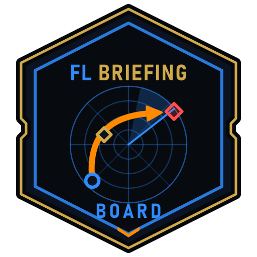
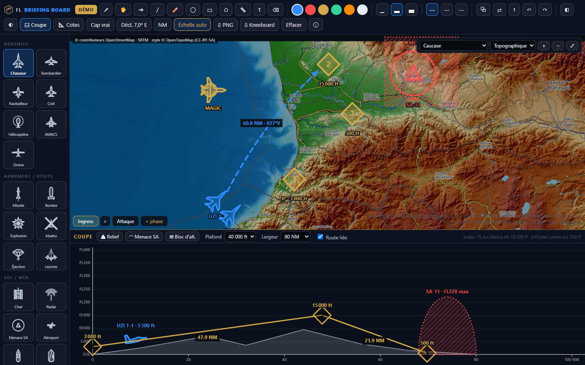
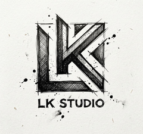

  

<h1 align="center">FL Briefing Board</h1>

  <b>Le tableau de briefing et de debriefing des escadrons DCS World.</b> 
  On pose les formes, on ne les dessine pas.

  <a href="https://ludens-kith.github.io/fl-briefing-board/?demo"><b>▶ Essayer la démo</b></a> ·
  <a href="https://l-k-studio.com">LK Studio</a> ·
  <a href="https://flightledger.io">FlightLedger</a> ·
  <a href="docs/GUIDE.md">Guide FR</a> ·
  <a href="docs/GUIDE.en-US.md">Guide EN-US</a>

  

---

## Ce qu'il fait

- **28 formes prêtes à poser** — chasseur, bombardier, ravitailleur, AWACS, hélicoptère,
  drone, missile, bombe, char, radar, menace sol-air, porte-avions, marqueurs tactiques.
  Posées et orientées d'un seul geste, recolorables, étiquetées (« UZI 1-1 · FL250 »).
- **Les cartes des 14 théâtres DCS** — topographique, satellite ou plan routier, cadrées
  sur chaque théâtre. La carte est vivante : on zoome, on se déplace, tout suit le
  terrain. **Distances et caps exacts, sans étalonnage.**
- **La coupe liée à la route** — l'écran se partage : vue de dessus en haut, profil
  d'altitude en bas, construit tout seul le long des waypoints. Relief, enveloppes
  sol-air, blocs d'altitude.
- **Caps vrais ou magnétiques** — déclinaison calculée par le modèle magnétique mondial
  du NOAA, ou saisie depuis la mission pour coller au cockpit.
- **Un briefing en plusieurs planches** — ingress, attaque, egress ; chaque phase part
  de la précédente.
- **Export kneeboard DCS** — la planche, sa coupe et ses caps, au format du cockpit.

Tout tient dans une page web : **aucune installation, aucun compte, rien à payer.**

## Pourquoi

À Tours, l'École de l'aviation de chasse a expérimenté *e-Brief*, une application qui
remplace le tableau blanc des salles de briefing. Elle est restée interne à l'Armée de
l'Air. **FL Briefing Board apporte cette idée à la communauté de la simulation** : un
tableau où l'on prépare une mission en quelques minutes, devant l'escadron, au doigt sur
un écran comme à la souris.

## Démarrer

- **En ligne** : [la démo](https://ludens-kith.github.io/fl-briefing-board/?demo) ouvre
  une frappe préparée au Caucase ; [le tableau vierge](https://ludens-kith.github.io/fl-briefing-board/)
  garde vos planches dans votre navigateur.
- **Sur votre poste** : téléchargez le dépôt et ouvrez `index.html`. Sous Windows,
  `tools\creer-raccourci.ps1` crée un raccourci qui ouvre l'outil dans sa propre fenêtre.

Les cartes demandent une connexion Internet ; le tableau blanc, non.

Les guides décrivent chaque geste et chaque raccourci :
[FR](docs/GUIDE.md) · [EN-US](docs/GUIDE.en-US.md).

## Soutenir

FL Briefing Board reste gratuit, sans compte et sans installation. Pour soutenir le
temps de conception et de documentation, voir [Soutenir / Ko-Fi](docs/SOUTENIR.md).
Le lien Discord permanent à partager dans les posts, hors image, est :
[discord.gg/cTepFwBPUy](https://discord.gg/cTepFwBPUy).

## Un projet LK Studio

<table>
  <tr>
    <td width="130"></td>
    <td>
      <b>FL Briefing Board est conçu et développé par <a href="https://l-k-studio.com">LK Studio</a></b>,
      studio de création logicielle installé à Tours.  
      Du même studio : <b><a href="https://flightledger.io">FlightLedger</a></b>, le carnet de vol et
      l'analyse de vos vrais vols DCS — Tacview, escadrons, progression. Le briefing prépare le vol ;
      FlightLedger raconte ce qui s'est passé.
    </td>
  </tr>
</table>

## Pour les développeurs

Zéro dépendance, zéro build : HTML, JavaScript et Canvas. Le projet documente ce qu'il
sait **et ce qu'il n'a pas vérifié** :

| | |
|---|---|
| [docs/ETAT.md](docs/ETAT.md) | ce qui est vérifié, daté, et ce qui ne l'est pas |
| [docs/MODELE.md](docs/MODELE.md) | le contrat interne du moteur |
| [docs/DEVELOPPER.md](docs/DEVELOPPER.md) | structure, outils, tests |
| [docs/SOUTENIR.md](docs/SOUTENIR.md) | Ko-Fi, invitations Discord, crédits des soutiens |
| [CHANGELOG.md](CHANGELOG.md) | chaque version, et ce qui a été vérifié en l'exécutant |

Les contributions sont bienvenues — un symbole qui manque, un théâtre, une correction.

## In English

**FL Briefing Board** is a free, browser-based briefing whiteboard for DCS World squadrons:
28 ready-to-place aviation symbols, live maps of the 14 DCS theatres,
an altitude profile linked to the route, true or magnetic headings (NOAA World Magnetic Model),
multi-phase boards and DCS kneeboard export. No install, no account.
[Try the demo](https://ludens-kith.github.io/fl-briefing-board/?demo), read the
[EN-US guide](docs/GUIDE.en-US.md), or join the
[FlightLedger Discord](https://discord.gg/cTepFwBPUy). Made in Tours, France, by
[LK Studio](https://l-k-studio.com) — also the makers of [FlightLedger](https://flightledger.io).

## Licence

Code sous [licence MIT](LICENSE). Les noms **FL Briefing Board**, **FlightLedger**,
**LK Studio** et leurs logos restent réservés : voir [MARQUES-ET-CREDITS.md](MARQUES-ET-CREDITS.md).
Projet indépendant, non affilié à Eagle Dynamics. DCS World est une marque d'Eagle Dynamics SA.
